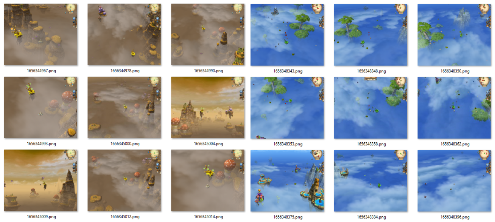
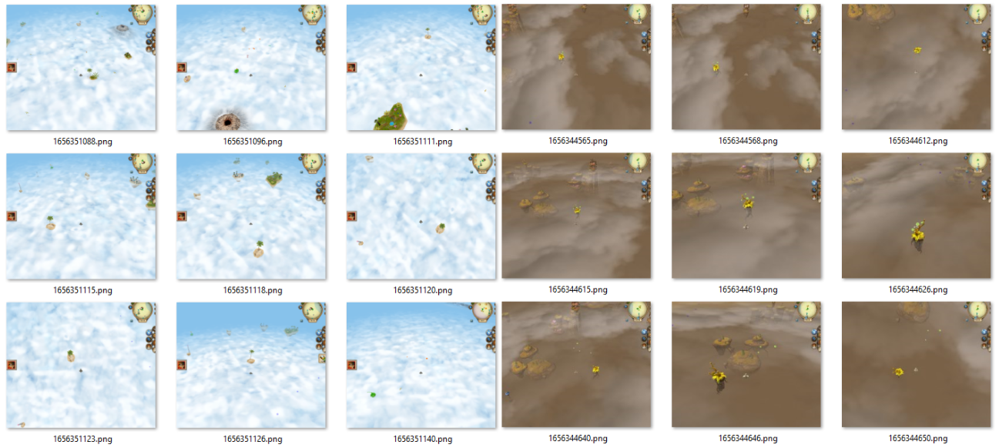
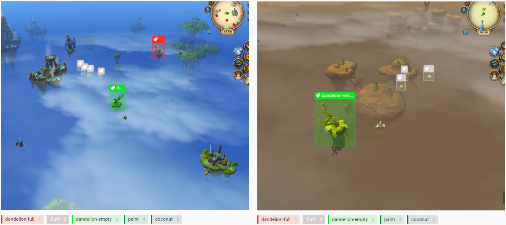
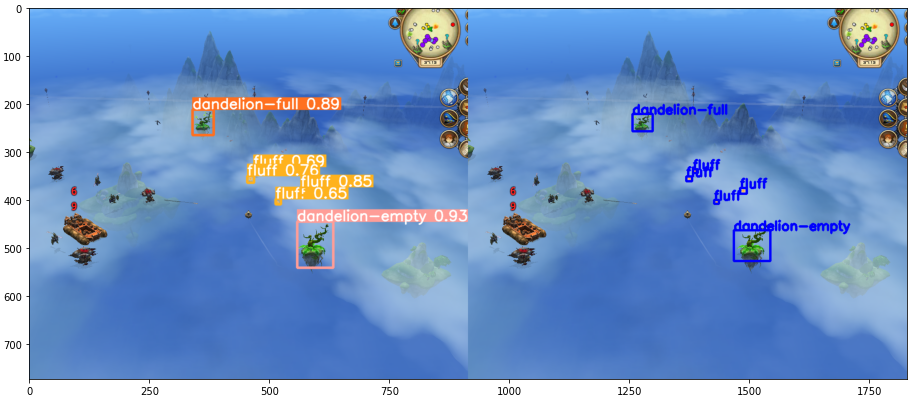

This folder contains steps to train and evaluate yolov5 model with custom data from scratch.

Steps to reproduce:
1. Collect lots of images.
2. Label images using labeling tool.
4. Train model and get weights file.
5. Initialize model with weights file & use it.

# Images collection
To collect images I played the game and took screenshots of different angles, positions and game locations.




# Images labeling 

I use [Label Studio](https://github.com/heartexlabs/label-studio) to label all my images. It is an awesome open source 
data labeling tool for all Data Science & Machine Leaning needs.



Next, export data as Yolo format from Label Studio. It exports data
in [yolov5 format for darknet](https://roboflow.com/formats/yolo-darknet-txt) 
framework. In the next steps this result will be converted into 
[yolov5 format for Pytorch](https://roboflow.com/formats/yolov5-pytorch-txt) 
framework.

# Train model

To train model I use Google Colab & Google Drive. After training the model I have **best.pt** file 
that has all weights for model. I just saved exported yolov5 labeled data into my Google Drive 
and run next Google Colab notebook to train model faster using powerful Google GPU. 

Steps:

1. Import data from Label studio.
2. Load it to Google Colab
3. Train model in Google Colab notebook
4. Download result file **best.pt** after training

After training I get some results:



# Execute model 

To use model run ``Detector.py`` file.

```python
detector = Detector(model_name="best.pt")

frame = np.array(pyautogui.screenshot())
print(detector.detect(frame, show=True))
```

You can use ```show=True``` to display image with objects otherwise you only get default output.
Output - list of lists with object label name, x1, y1, x2, y2 coordinates: 

```
[['palm', 257, 342, 380, 470], ['dandelion-full', 480, 288, 506, 327]]
```
